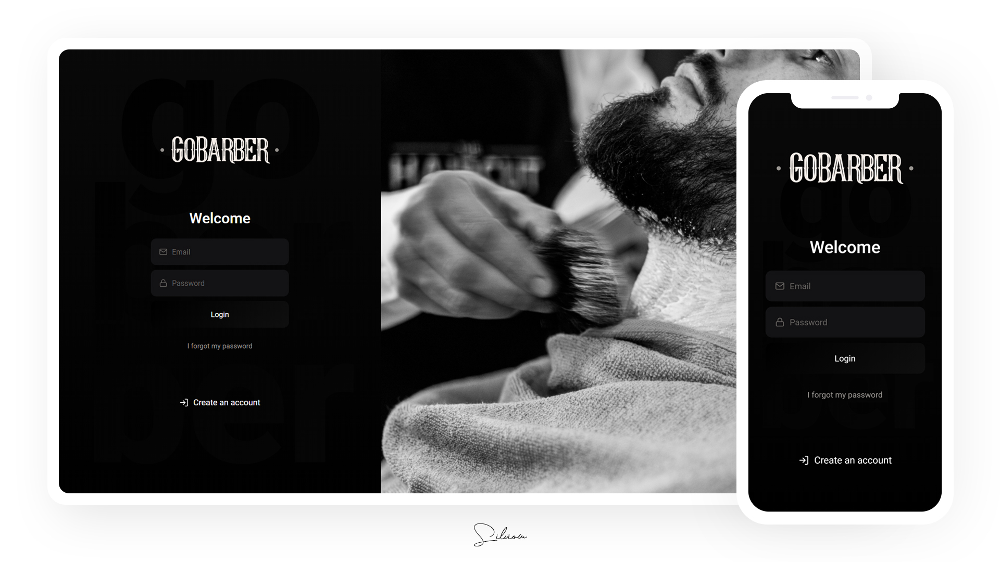
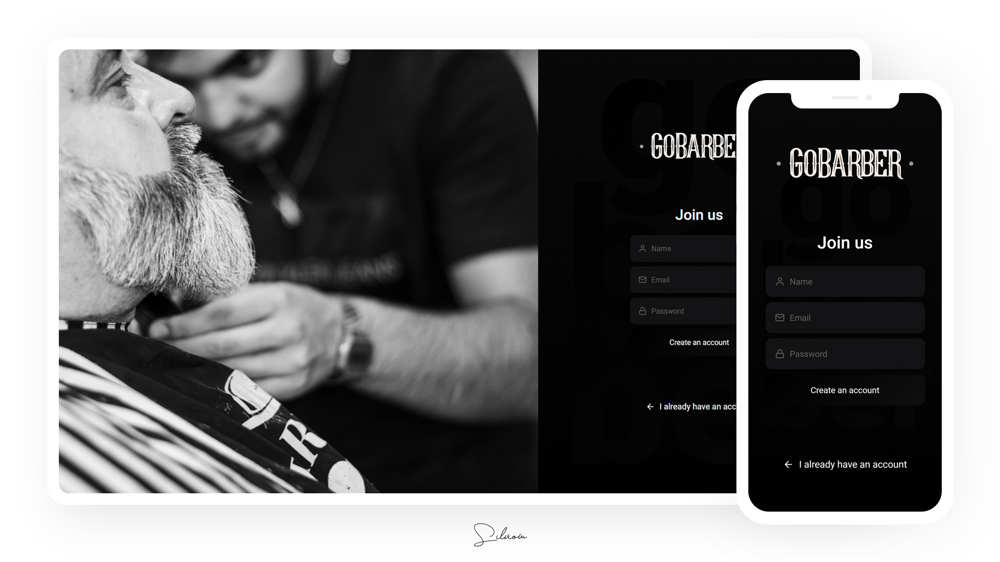

# GoBarber
:date: A 2nd version of GoBarber, an app for barber appointment and scheduling.

Cross-platform application being developed for study purposes with Node.js, TypeScript, React.js and React Native.

Also check out [the old version of this app](https://github.com/silviow/gobarber) :)

Some technologies and tools used so far on this project:

- Node.js
- TypeScript
- Express
- TypeORM
- PostgreSQL
- ESLint
- Prettier
- Unform
- React.js
- React Native

